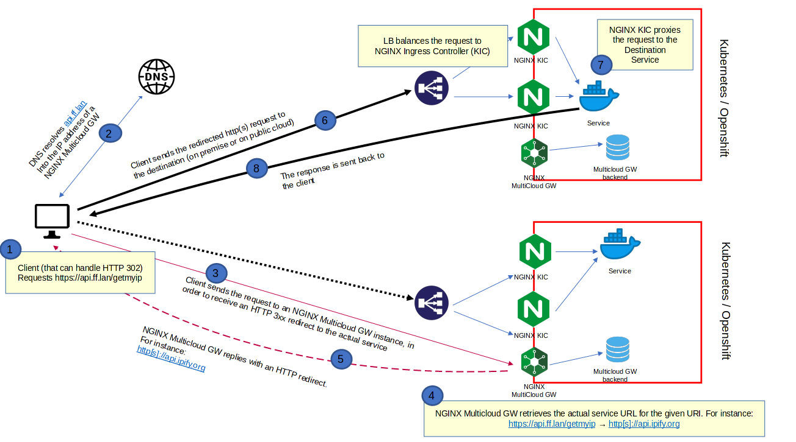
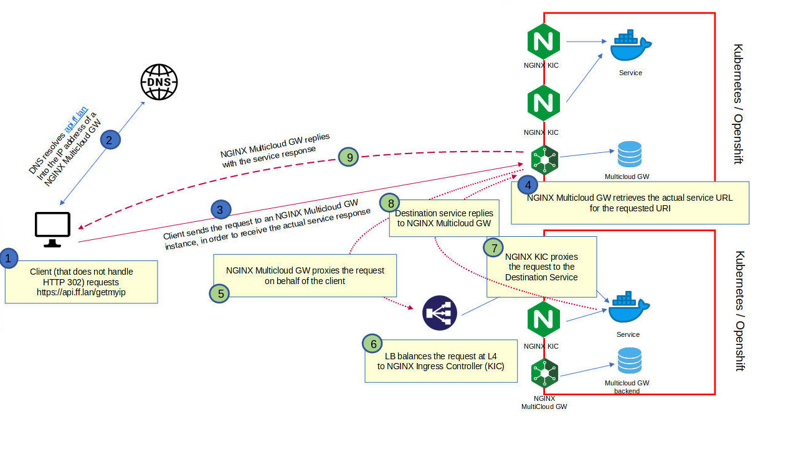

# NGINX Multicloud Gateway

## Description

This NGINX "Multicloud Gateway" configuration allows dynamic proxying/redirection of REST API calls regardless of where the actual destination REST API is located (on premise datacenter / off-prem cloud provider).

NGINX acts as a global gateway for REST API access, REST API mapping (what clients request vs where the API runs) is dynamically configured through the backend database.

This repo provides a very simple example, in a production deployment it can be any backend/repository (SQL, noSQL, key/value, ...) that can be queried through REST API calls.

The two supported modes of operation are rewrite and steering.

## Rewrite mode



## Steering mode



## Prerequisites

- Kubernetes or Openshift cluster
- Linux VM with Docker to build all images
- Private registry to push the NGINX Plus and backend DB images
- The NGINX Plus image must include javascript (nginx-plus-module-njs) support


## Building the NGINX Plus image

Refer to the official documentation at

```
https://docs.nginx.com/nginx/admin-guide/installing-nginx/installing-nginx-docker/#docker_plus
```

## Deploying this repository

Build the backend DB:

```
cd test-backend-db
docker build --no-cache -t YOUR_PRIVATE_REGISTRY/mcgw-test-backend-db:1.0 .
docker push YOUR_PRIVATE_REGISTRY/mcgw-test-backend-db:1.0
```

Spin up NGINX Plus:

1. Update the backend DB "image" line referenced in 1.mcgw-test-backend-db.yaml
2. Update the NGINX Plus "image" line referenced in 5.nginx-mcgw.yaml
3. Run the following commands

```
cd mcgw
kubectl apply -f 0.mcgw.ns.yaml 
cd certs
./cert-install.sh install
cd ..
kubectl apply -f 1.mcgw-test-backend-db.yaml 
kubectl apply -f 2.nginx.conf.yaml 
kubectl apply -f 3.mcgw.js.yaml 
kubectl apply -f 4.mcgw.conf.yaml 
kubectl apply -f 5.nginx-mcgw.yaml 
```

## Cleaning up this repository

```
cd mcgw
kubectl delete -f 0.mcgw.ns.yaml
```

## Namespace check

```
$ kubectl get all -n nginx-mcgw
NAME                                        READY   STATUS    RESTARTS   AGE
pod/mcgw-test-backend-db-5495877b88-hfq95   1/1     Running   0          56s
pod/nginx-mcgw-765c664-z2wqb                1/1     Running   0          25s

NAME                           TYPE        CLUSTER-IP      EXTERNAL-IP   PORT(S)           AGE
service/mcgw-test-backend-db   ClusterIP   10.100.198.14   <none>        5000/TCP          56s
service/nginx-mcgw             ClusterIP   10.101.80.253   <none>        80/TCP,8080/TCP   25s

NAME                                   READY   UP-TO-DATE   AVAILABLE   AGE
deployment.apps/mcgw-test-backend-db   1/1     1            1           56s
deployment.apps/nginx-mcgw             1/1     1            1           25s

NAME                                              DESIRED   CURRENT   READY   AGE
replicaset.apps/mcgw-test-backend-db-5495877b88   1         1         1       56s
replicaset.apps/nginx-mcgw-765c664                1         1         1       25s
```


## Backend DB test

```
$ curl -ks "https://db.mcgw.ff.lan/mcgw?fqdn=api.ff.lan&uri=/getmyip" | jq
[
  {
    "enabled": "true",
    "fqdn": "api.ff.lan",
    "rewrite": "http://api.ipify.org",
    "title": "Gets my IP in plaintext",
    "uri": "/getmyip"
  }
]
```

```
$ curl -ks "https://db.mcgw.ff.lan/mcgw?fqdn=api.ff.lan&uri=/getmyip/json" | jq
[
  {
    "enabled": "true",
    "fqdn": "api.ff.lan",
    "rewrite": "http://api.ipify.org?format=json",
    "title": "Gets my IP in json",
    "uri": "/getmyip/json"
  }
]
```

```
$ curl -ks "https://db.mcgw.ff.lan/mcgw?fqdn=api.ff.lan&uri=/getmyip/json/callback" | jq
[
  {
    "enabled": "true",
    "fqdn": "api.ff.lan",
    "rewrite": "http://api.ipify.org?format=jsonp",
    "title": "Gets my IP in json with callback",
    "uri": "/getmyip/json/callback"
  }
]
```

## Log level configuration

Log level can optionally be configured at runtime for each FQDN and URI accessed by clients. The current version supports either "full" or "basic", as defined in 4.mcgw.conf.yaml

```
$ curl -ki -X POST https://api.mcgw.ff.lan/api/6/http/keyvals/dynamic_loglevel -d '{"api.ff.lan:/getmyip":"full"}'
HTTP/1.1 201 Created
Server: nginx/1.19.5
Date: Sun, 22 Aug 2021 22:33:04 GMT
Content-Length: 0
Connection: keep-alive
Location: http://api.mcgw.ff.lan:8080/api/6/http/keyvals/dynamic_loglevel/
```

```
$ curl -ki -X POST https://api.mcgw.ff.lan/api/6/http/keyvals/dynamic_loglevel -d '{"api.ff.lan:/getmyip/json":"basic"}'
HTTP/1.1 201 Created
Server: nginx/1.19.5
Date: Sun, 22 Aug 2021 22:33:28 GMT
Content-Length: 0
Connection: keep-alive
Location: http://api.mcgw.ff.lan:8080/api/6/http/keyvals/dynamic_loglevel/
```

Retrieve currently configured log levels:

```
$ curl -ks -X GET https://api.mcgw.ff.lan/api/6/http/keyvals/dynamic_loglevel | jq
{
  "api.ff.lan:/getmyip": "full",
  "api.ff.lan:/getmyip/json": "basic"
}
```

## Multicloud Gateway testing

1. Rewrite mode

Client supporting HTTP/302 calling a REST API:

```
$ curl -ki -H "X-REDIRECT-SUPPORT: true" https://api.ff.lan/getmyip
HTTP/1.1 302 Moved Temporarily
Server: nginx/1.19.5
Date: Sun, 22 Aug 2021 22:55:50 GMT
Content-Type: text/html
Content-Length: 146
Connection: keep-alive
Location: http://api.ipify.org

<html>
<head><title>302 Found</title></head>
<body>
<center><h1>302 Found</h1></center>
<hr><center>nginx/1.19.10</center>
</body>
</html>
```

NGINX mcgw log shows the following. The last line is the access_log in "basic" format, as configured above.

```
$ kubectl logs -l app=nginx-mcgw -n nginx-mcgw -f
2021/08/22 23:07:53 [warn] 7#7: *7 js: ------------------------------
2021/08/22 23:07:53 [warn] 7#7: *7 js: Client[10.244.2.229] Method[GET] Host[api.ff.lan] URI[/getmyip] QueryString[undefined] Body[undefined]
2021/08/22 23:07:53 [warn] 7#7: *7 js: subReqCallback got 200 for [/getmyip]
2021/08/22 23:07:53 [warn] 7#7: *7 js: JSON reply: URI[/dbQuery/mcgw?fqdn=api.ff.lan&uri=/getmyip] status[200] body[[{"enabled":"true","fqdn":"api.ff.lan","rewrite":"http://api.ipify.org","title":"Gets my IP in plaintext","uri":"/getmyip"}]
]
2021/08/22 23:07:53 [warn] 7#7: *7 js: Found 1 DB records for [/getmyip]
2021/08/22 23:07:53 [warn] 7#7: *7 js: Rewrite rule [api.ff.lan/getmyip] -> [http://api.ipify.org] X-REDIRECT-SUPPORT [true]
2021/08/22 23:07:53 [warn] 7#7: *7 js: Redirect mode 302 to [http://api.ipify.org]
[MCGW full] 10.244.2.229 [22/Aug/2021:23:07:53 +0000] api.ff.lan "GET /getmyip HTTP/1.1" "-" 302 146 "-" "curl/7.74.0"
```

2. Steering mode

Client with no HTTP/302 support calling a REST API:

```
$ curl -ki https://api.ff.lan/getmyip
HTTP/1.1 200 OK
Server: nginx/1.19.5
Date: Sun, 22 Aug 2021 22:58:39 GMT
Content-Type: text/plain
Content-Length: 12
Connection: keep-alive
Vary: Origin
Via: 1.1 vegur

192.168.1.18
```

NGINX mcgw log shows the following. The last line is the access_log in "basic" format, as configured above.

```
$ kubectl logs -l app=nginx-mcgw -n nginx-mcgw -f
2021/08/22 23:10:22 [warn] 7#7: *15 js: ------------------------------
2021/08/22 23:10:22 [warn] 7#7: *15 js: Client[10.244.1.179] Method[GET] Host[api.ff.lan] URI[/getmyip] QueryString[undefined] Body[undefined]
2021/08/22 23:10:22 [warn] 7#7: *15 js: subReqCallback got 200 for [/getmyip]
2021/08/22 23:10:22 [warn] 7#7: *15 js: JSON reply: URI[/dbQuery/mcgw?fqdn=api.ff.lan&uri=/getmyip] status[200] body[[{"enabled":"true","fqdn":"api.ff.lan","rewrite":"http://api.ipify.org","title":"Gets my IP in plaintext","uri":"/getmyip"}]
]
2021/08/22 23:10:22 [warn] 7#7: *15 js: Found 1 DB records for [/getmyip]
2021/08/22 23:10:22 [warn] 7#7: *15 js: Rewrite rule [api.ff.lan/getmyip] -> [http://api.ipify.org] X-REDIRECT-SUPPORT [undefined]
2021/08/22 23:10:22 [warn] 7#7: *15 js: Steering mode to [http://api.ipify.org]
2021/08/22 23:10:22 [warn] 7#7: *15 js: POSTSCHEME[api.ipify.org] QSTRING[undefined]/[undefined] FULLURI[api.ipify.org,] FQDNURI[api.ipify.org/] REWRITEURI[] -- []
2021/08/22 23:10:22 [warn] 7#7: *15 js: Rewrite [http://api.ipify.org] -> scheme[http] fqdn[api.ipify.org] URI[/] queryString[] -> [http://api.ipify.org/]
2021/08/22 23:10:23 [warn] 7#7: *15 js: steeringModeSubReqCallback got [200] [192.168.1.18]
[MCGW full] 10.244.1.179 [22/Aug/2021:23:10:23 +0000] api.ff.lan "GET /getmyip HTTP/1.1" "-" 200 12 "-" "curl/7.74.0"
```

3. Steering mode

Client with no HTTP/302 support calling a REST API:

```
$ curl -ki https://api.ff.lan/getmyip/json
HTTP/1.1 200 OK
Server: nginx/1.19.5
Date: Sun, 22 Aug 2021 23:10:58 GMT
Content-Type: text/plain
Content-Length: 12
Connection: keep-alive
Vary: Origin
Via: 1.1 vegur

192.168.1.18
```

NGINX mcgw log shows the following. The last line is the access_log in "basic" format, as configured above.

```
2021/08/22 23:10:58 [warn] 7#7: *17 js: ------------------------------
2021/08/22 23:10:58 [warn] 7#7: *17 js: Client[10.244.1.179] Method[GET] Host[api.ff.lan] URI[/getmyip/json] QueryString[undefined] Body[undefined]
2021/08/22 23:10:58 [warn] 7#7: *17 js: subReqCallback got 200 for [/getmyip/json]
2021/08/22 23:10:58 [warn] 7#7: *17 js: JSON reply: URI[/dbQuery/mcgw?fqdn=api.ff.lan&uri=/getmyip/json] status[200] body[[{"enabled":"true","fqdn":"api.ff.lan","rewrite":"http://api.ipify.org?format=json","title":"Gets my IP in json","uri":"/getmyip/json"}]
]
2021/08/22 23:10:58 [warn] 7#7: *17 js: Found 1 DB records for [/getmyip/json]
2021/08/22 23:10:58 [warn] 7#7: *17 js: Rewrite rule [api.ff.lan/getmyip/json] -> [http://api.ipify.org?format=json] X-REDIRECT-SUPPORT [undefined]
2021/08/22 23:10:58 [warn] 7#7: *17 js: Steering mode to [http://api.ipify.org?format=json]
2021/08/22 23:10:58 [warn] 7#7: *17 js: POSTSCHEME[api.ipify.org?format=json] QSTRING[format=json]/[undefined] FULLURI[api.ipify.org,] FQDNURI[api.ipify.org/] REWRITEURI[] -- []
2021/08/22 23:10:58 [warn] 7#7: *17 js: Rewrite [http://api.ipify.org?format=json] -> scheme[http] fqdn[api.ipify.org] URI[/] queryString[] -> [http://api.ipify.org/]
2021/08/22 23:10:58 [warn] 7#7: *17 js: steeringModeSubReqCallback got [200] [192.168.1.18]
[MCGW basic] 10.244.1.179 [22/Aug/2021:23:10:58 +0000] api.ff.lan "GET /getmyip/json HTTP/1.1" 200
```
